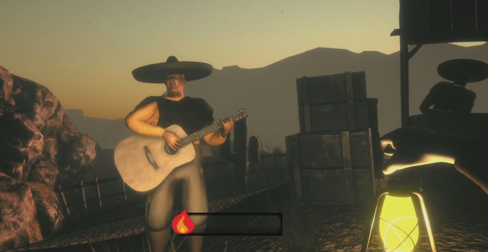
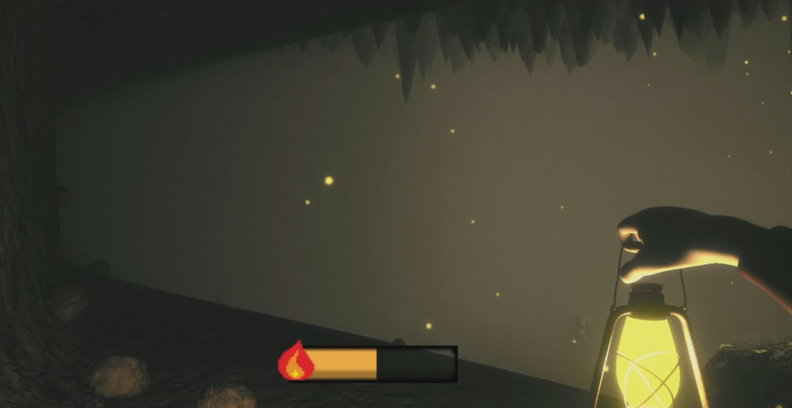

# Unity project

A project made with unity for pc (windows) using 3d enviroment

## Getting Started

This is a developer build used for testing purposes 

### Prerequisites

Requirements include unity ( see version )

```
min version  ==  2020.1.6f1
test version == 2020.3.0f1
```

### Using
```
	unity build version == 2020.3.0f1
```


## Deployment

 Additional notes about how to deploy this on a live system

## Built With

* [Unity](https://unity.com/) - Program used
* [Blender](https://www.blender.org/) - 3d models made with



[Video](https://www.youtube.com/watch?v=iRzVDQLxADk)


## Authors

* **Ossi H** - *Initial work, programming* - [ossi1801](https://github.com/ossi1801)
* **Otto L** - *3d design, animation* - [OttoLeivo](https://github.com/OttoLeivo)
* **Joona** - *Sound design, UI, miscellaneous  work* - [joona1808](https://github.com/joona1808)

See also the list of [contributors](https://github.com/your/project/contributors) who participated in this project.

## License

This project is licensed under the MIT License - see the [LICENSE](LICENSE) file for details

## Acknowledgments

* [Adobe mixamo](https://www.mixamo.com/)
* [Community page in unity](https://answers.unity.com/)
* 
